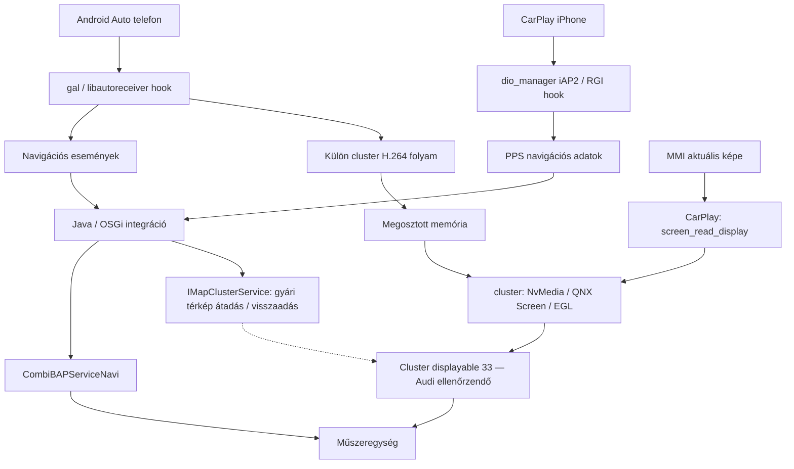

# Audi Q3 F3 MH2P — forráskód-alapú megvalósíthatósági vizsgálat

Vizsgálat: 2026-09-16. Cél: a felhasználó által megadott 2019-es Q3 F3, MH2p_ER_AU_P2873, CLU28_MMX2P_AU_ER_G35S_006PROD-1. Az AUG35 besorolás munkahipotézis; a teljes szoftverazonosítót és a 5F/17 hardverazonosítókat még ellenőrizni kell. Az autóhoz nem történt csatlakozás, módosítás vagy telepítőfuttatás.

## Döntés

Kész, igazoltan ehhez a Q3-hoz használható közösségi csomagot az átvizsgált repókban és nyilvános forkokban nem találtam. Saját porthoz érdemi forráskód van, de a működés még nem garantálható. A három külön cél: navigációs utasítások, MMI-tükrözés, illetve az MMI-től független térképkép. Az első kettőhöz közelebb állunk. A harmadik Android Autónál külön videófolyammal szerepel a forrásban; CarPlaynél a főág tükröz, a második képernyő külön kutatási feladat.

Nem indokolt a Porsche telepítő márkaellenőrzésének átírása és kipróbálása. Először a tényleges Audi firmware szolgáltatásait és bináris interfészeit kell összevetni a kóddal.

## Vizsgált források és rögzített állapot

| Projekt | Vizsgált HEAD | Szerep |
|---|---|---|
| [fifthBro/mh2p-cluster](https://github.com/fifthBro/mh2p-cluster) | a37c917c1b1479e11684e158efc0e1be3c07faa7 | MH2P navigációs integráció, natív videókód, Porsche telepítő |
| [LawPaul/MH2p_SD_ModKit](https://github.com/LawPaul/MH2p_SD_ModKit) | 82f9452401022a4a5deadbbb4aaa86fdf7ce71fb | Update/Post/Persist futtatási keret, failsafe |
| [t0chk/Q3Team-MH2p-GEM](https://github.com/t0chk/Q3Team-MH2p-GEM) | ba1fe0bd3bcb860cd5d1a49e7010d7e7f66a8315 | Q3-specifikus GEM/modding alap, backup és diagnosztikai eszközök |
| [Lanye-z/MHI2Q-CarPlay-RGI-MMI-Mirror](https://github.com/Lanye-z/MHI2Q-CarPlay-RGI-MMI-Mirror) | 4c914eb72773db6721b60f8fa200487a40645ecc | Más platformon megvalósított capture/render/layout referencia |

A négy repó forrása és Git-metaadatai helyben olvasva; a cluster repó 45 főági commitja, ágai, tagjei, a régi és új telepítőcsomag releváns scriptjei, minden elérhető issue és komment, PR-lista, nyolc fork távoli ágai vizsgálva. A cluster főágnak egy ága volt, tag nem volt; a PR-lista üres; Discussions nincs engedélyezve. A forkok új commitjait és a releváns eltéréseket is ellenőriztem. Ez nem a teljes internet vagy zárt Telegram-csoportok kimerítő feltárása, és nem dinamikus firmware-audit.

## Mit bizonyít a history?

Az Audi/VW áthúzás a [ca5f0f9 commitban](https://github.com/fifthBro/mh2p-cluster/commit/ca5f0f904814496598bd6effffe6cb0fcfaed7f2), 2026-03-10-én történt. Ez README-változás volt, nem Audi-kód eltávolítása.

A legkorábbi elérhető buildet hozzáadó 2aa27f5 commit AndroidAutoCluster_v01027_a38ec9a.zip csomagjában az Update/install.sh már kizárólag OEM=PO esetén telepített. Az áthúzáskori csomag is ezt tartalmazta. Nem találtam bizonyítékot arra, hogy a korábbi, Audi/VW-t említő leírás működő Audi implementációt takart volna.

Az [AUG35 P2711 kompatibilitási kérdésre adott fejlesztői válasz](https://github.com/fifthBro/mh2p-cluster/issues/8#issuecomment-4826033001) kifejezetten kizárja az Audi/VW kompatibilitást. A technikai indokot nem fejti ki. A [16-os issue](https://github.com/fifthBro/mh2p-cluster/issues/16) ugyanezt a megvalósíthatósági kérdést teszi fel; a vizsgálatkor nem volt válasz. Tehát a támogatás hiányának pontos szerzői indoklása továbbra is ismeretlen.

A legújabb v0034 csomag telepítője szintén PO márkát és 26xx/28xx szoftversávot követel. A P2873 száma önmagában nem tesz kompatibilissé egy AU firmware-t. Ráadásul az install.sh a márkaellenőrzés előtt írhatóan remountolja az app fájlrendszert: a csomag behelyezése sem tekinthető ártalmatlan kompatibilitástesztnek.

## Architektúra a tényleges kód alapján

Ez a Porsche MH2P forrásban megfigyelt logikai lánc. A Q3 alsóbb szintű kijelzőtovábbítása, display-azonosítói és fizikai útvonala nincs ezzel igazolva. A BAP utasításadatokat továbbít; a térképpixelek külön renderelési útvonalon haladnak.

### CarPlay

Forrás: [dio_manager_preload.c](https://github.com/fifthBro/mh2p-cluster/blob/a37c917/src/dio_manager_preload.c), valamint lsd/de/audi/app/terminalmode/smartphone/carplay/CarPlayClusterIntegration.java és CarPlayDSIManager.java.

A natív hook iAP2 azonosítási/route-guidance üzenetekbe kapcsolódik, RGI adatokat publikál PPS-re; a Java komponens ezeket BAP navigációs állapottá alakítja. Ez nyilakat, távolságot és szöveges információt ad, nem önálló térképet.

A CarPlayClusterIntegration.handleScreenOwnerChange() a főképernyő tulajdonosváltására indítja a mirror folyamatot. A kiadott start parancs nem választ H.264 módot; a cluster.c alapértelmezett capture módja display. A renderelő a központi kijelzőt olvassa, méretezi és kivágja. Ezért a kódból nem következik, hogy az MMI-n Spotify-ra váltva a cockpitben megmaradna a térkép. CarPlay Dashboard kivágása sem egyenértékű két független alkalmazásfelülettel.

### Android Auto

Forrás: [gal_cluster.c](https://github.com/fifthBro/mh2p-cluster/blob/a37c917/src/gal_cluster.c), cluster_h264_shm.h, AndroidAutoClusterIntegration.java.

A hook a libautoreceiver szolgáltatásfelderítését és kapcsolódó üzeneteit kezeli. A fájl elején leírt navigációs képút mellett a későbbi kód külön cluster videószolgáltatást és H.264 adatfolyamot is kezel. A Java alapértelmezett aaClusterMode értéke h264; a megosztott adatfolyamot a natív renderer dekódolja. Ez sokkal jobb alap az MMI-től független térképhez, mint a központi kijelző másolása. A konkrét telefon/app együttműködést, fókuszváltásokat és Audi-kimenetet azonban külön tesztelni kell.

### MH2P videó és gyári térkép

Forrás: [cluster.c](https://github.com/fifthBro/mh2p-cluster/blob/a37c917/src/cluster.c), ClusterMapController.java és AndroidAutoClusterActivator.java.

A renderer QNX Screen és EGL API-kra épül, H.264 módhoz NvMedia interfészeket használ. A cél displayable alapértelmezetten 33; a fallback méret 1280×860, létezik méretfelderítés és Porsche/Macan kezelés. Ezek nem tekinthetők Q3-konstansoknak. A gyári navi átadásához IMapClusterService metódusok szerepelnek, például suspendSetup, switchKombiMapToHiddenContext, majd a visszaállítás megfelelő párjai. Ezeket a tényleges Audi JAR-okkal kell ellenőrizni.

### MHI2Q referencia

A [saját architektúradokumentuma](https://github.com/Lanye-z/MHI2Q-CarPlay-RGI-MMI-Mirror/blob/4c914eb/MMI-Mirror/docs/architecture.md) kifejezetten jövőbeli forrásként kezeli a valódi második képernyőt. A jelenlegi megoldás MMI capture, saját displayable/context routing és opcionális RGI réteg. A libdisplayinit, display_create_window, valamint a 3/98/101/102 és 70/80 jellegű display/context konfigurációk platformfüggőek. Ezeket nem szabad MH2P-re változatlanul átemelni. A repo jelenlegi leírása sportlayout-korlátot és automatikus indításnál feketeképernyő-hibát is említ.

## Forkok

| Fork / ág | Vizsgálati eredmény |
|---|---|
| southmyth/main | Ugyanaz a HEAD, mint upstream |
| wlrnet/main | Ugyanaz a HEAD, mint upstream |
| wshan053/main | Ugyanaz a HEAD, mint upstream |
| jims123/main | Ugyanaz a HEAD, mint upstream |
| Developefd/main | Ugyanaz a HEAD, mint upstream |
| moldovanugeorge/mh2p-cluster-Porsche main | Régebbi upstream állapot |
| xilolo03-dotcom/main és beta2-candidate | Korábbi állapot, mirror/átmenet/Macan/encoder módosítások; nem azonosított Audi-port |
| samueljiahua/main és samueljiahua-patch-1 | CarPlay AltScreen Probe V1 és dio_cluster.so buildworkflow; kutatási nyom, nem kész másodikkijelző-megoldás |

A [samueljiahua fork](https://github.com/samueljiahua/mh2p-cluster) legérdekesebb része a dio_manager_preload.c iAP2 azonosítási kísérlete. Egy TLV jelenlétét vizsgálja/módosítja; nincs hozzá teljes második CarPlay videóút igazolva. A workflow egyetlen natív library buildjét célozza QNX 6.5 ARM toolchainnel. Ez nem teljes reprodukálható Audi build, és a cél MH2P ABI-val való egyezést nem bizonyítja. A workflow-t nem futtattam.

## Kompatibilitási mátrix

| Elem | Újrahasznosítható alap | Q3-specifikus bizonyíték / munka |
|---|---|---|
| RGI/parszolás, manőverleképezés | Jelentős | Apponkénti eseményadatok, vezetékes/vezeték nélküli eltérések |
| Android Auto videókinyerés | Jelentős | Audi gal/libautoreceiver exportok és ABI, stream-egyeztetés |
| BAP Java integráció | Részben | JAR-verziók, metódusszignatúrák, service lifecycle, cluster képességek |
| Gyári térkép átadása | Részben | Audi IMapClusterService, kijelzőfókusz és visszaállítás |
| Natív renderer | Részben | QNX/NvMedia ABI, display routing, méret, normál/sport layout |
| CarPlay külön térképkép | Hiányos | Önálló másodikkijelző-protokoll és kompatibilis appok |
| ModKit | Telepítési keret | Nem bizonyítja a benne futtatott mod kompatibilitását |
| Q3Team GEM | Q3-as fejlesztési alap | Nem cluster/video port; régebbi ModKit konvenciókat használ |

A de.audi Java namespace közös platformörökség lehet: a Porsche-only kiadás is ezt használja. Nem kompatibilitási bizonyíték. A projektek egy része CC BY-NC-SA feltételekkel közli a forrást; ezt nem helyes korlátozásmentes open-source licencként kezelni.

## Build és validáció: jelenlegi határ

A [10-es issue](https://github.com/fifthBro/mh2p-cluster/issues/10) is jelzi a README-ben említett teljes buildscript és függőséglista hiányát. A repó önmagában nem ad ellenőrzött, teljes Audi buildkörnyezetet. Szükség van a megfelelő QNX toolchainre/fejlécekre, platformlibrary-kra, firmware-specifikus Java függőségekre és a telepített HMI-bundle struktúrájára. A kiadási ZIP fájlnevében szereplő rövid hash nem elegendő a bináris és a publikus forrás teljes megfeleltetéséhez.

Ebben a vizsgálatban nem készült bináris, telepítő, firmware-módosítás vagy járműteszt. A forráskódot és a ZIP-ben lévő telepítési scripteket csak olvastam. A kompatibilitási következtetés statikus vizsgálaton alapul.

## Kockázat és recovery-terv

| Hiba | Következmény | Elvárt védelem a későbbi implementációban |
|---|---|---|
| Rossz natív ABI/szimbólum | gal/dio_manager összeomlik; telefonintegráció kiesik | Pontos firmware- és hash-engedélylista; ismeretlen verzión nincs módosítás |
| Hibás JAR/service integráció | HMI-hiba vagy bootloop | Eredeti JAR és manifest mentése; független rollback |
| Hibás display routing | Fekete vagy eltakart térképfelület | Benchteszt, manuális indulás, időkorlát, gyári nézet automatikus visszaadása |
| Két navi verseng a felületért | Villogás, rossz fókusz, beragadt kép | Explicit állapotgép és tulajdonjogkezelés |
| Megszakadó telepítés | Részleges, kevert állapot | Előzetes ellenőrzés, ellenőrzött backup, atomi fájlcsere ahol lehetséges |
| Nem fut a normál uninstall | Nem állítható helyre menüből | Előre igazolt korai failsafe vagy megfelelő bench/emergency elérés |

A ModKit v2 README szerint a failsafe.sh korai startup során futtatható. Ez feltételes menekülőút: előbb telepített és működő ModKit-indulási lánc szükséges. Nem jelent bármilyen meghibásodásból garantált helyreállítást. A Porsche uninstall csak a saját módosításait próbálja visszacsinálni; nem teljes gyári állapotmentés.

A szükséges mentési kör: eredeti érintett fájlok, jogosultságok, hash-ek, HMI/JAR manifestek, startup/JSON konfigurációk, diagnosztikai kódolás/adaptáció, firmware- és hardverazonosítók. A teljes egység helyreállításához ezen túl firmware-specifikus partíció- és recovery-ismeret kell. FEC/CP adatokat nem kell és nem szabad ehhez a funkcióhoz módosítani. Az átlagos VCDS-mentés nem helyettesít fájlrendszer- vagy partíciómentést.

## Megvalósítási útiterv és döntési kapuk

1. **Pontos autóazonosítás.** 5F és 17 teljes hardver/szoftver azonosítók; teljes MMI verziófotó; gyári navigáció cockpitben való megjelenése; meglévő módosítások listája; CarPlay vezetékes/vezeték nélküli működés. VIN/sorozatszám megosztása nem szükséges.
2. **Offline Audi firmware-összehasonlítás.** A felhasználónál már meglévő, pontos firmware-csomag vagy jogszerűen rendelkezésre álló dump olvasása. gal, dio_manager, libautoreceiver, displaykonfigurációk, releváns HMI/OSGi JAR-ok és exportok összevetése. Ha nincs pontos egyezés, nem készül telepítő.
3. **Reprodukálható build kialakítása.** Verziórögzített toolchain, függőségleltár, Java API-ellenőrzés, natív ELF-import/export ellenőrzés. Külön kezelni a build sikerét és a hardverkompatibilitást.
4. **Offline tesztek.** RGI/AA üzenet-fixture-ök és hibás bemenetek, állapotátmenetek, telefonleválasztás, gyári navra visszaadás, timeout, crop/layout számítások. A QNX GPU/hardver működését mockteszt nem bizonyítja.
5. **Recovery előzetes igazolása.** Eredeti fájlok és külső másolat, ellenőrzött hash, bootloop esetén is elérhető rollback. Célszerű kompatibilis asztali egységen kezdeni; a bench összetételét az azonosítók után kell meghatározni.
6. **Minimális Audi prototípus.** Előbb service-azonosítás, majd csak guidance; külön lépésben ideiglenes tesztkép a navigációs felületen; végül mirror/AA külön stream. Autostart csak stabil kézi működés után. Ez későbbi szakasz, jelenleg nincs rá csomag.
7. **CarPlay önálló második kijelző.** Külön kutatási ág a samueljiahua kísérlet alapján. Sikerfeltétel: a cockpit térképe frissül akkor is, amikor az MMI-n másik CarPlay app látható. Enélkül csak tükrözésként nevezhető késznek.
8. **Járműteszt.** Álló autó, stabil táp, visszaállítás kéznél; appváltás, hívás, kamera/parkolási nézet elsőbbsége, telefonvesztés, gyári navi, normál/sport layout, alvás/ébredés. Csak a bench és rollback kapuk teljesítése után.

Első ésszerű fejlesztési döntés: Audi-kompatibilis kijelzőbackend és gyári nav-visszaállítás bizonyítása. Ha ez megvan, Android Auto külön stream vagy CarPlay mirror következhet. Az ideális, két külön appot mutató CarPlay megoldás határidejét a jelenlegi bizonyítékokból nem lehet felelősen megígérni.

## Következő bemenet a felhasználótól

A teljes MMI szoftververzió képe, a VCDS 5F és 17 azonosító része, valamint annak megerősítése, hogy a gyári térkép most látszik-e a cockpitben. Ha megvan a korábban használt pontos firmware-csomag, annak fájllistája/manifestje segít elindítani az offline összevetést. Ehhez egyelőre sem új ModKit, sem SSH-aktiválás, sem más autómódosítás nem szükséges.
